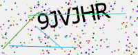
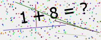

# OTP & CAPTCHA Generator

A simple utility for generating OTPs (One-Time Passwords) and CAPTCHAs (both text-based and math-based). This library provides flexibility in character sets and customization options, making it easy to integrate into your applications.

## Features

- Generate OTPs with digits, upper case, lower case, and special characters.
- Generate text-based CAPTCHA with noise and distortion for security.
- Generate math-based CAPTCHA for different difficulty levels.
- Outputs CAPTCHA as an image saved in PNG format.

## Installation

Install the package using npm:

```bash
npm install otp-captcha-generator;
npm install canvas
```
## Usage
learn How to use this package.

# 1. OTP Generation

You can generate OTPs of any length with customizable options such as digits, upper case, lower case, and special characters.
```bash
const { generateOTP } = require('otp-captcha-generator');

// Generate a 6-digit OTP (default)
const otp = generateOTP();
console.log(otp);  // Example output: '123456'

// Generate an OTP with custom options
const customOtp = generateOTP(8, { upperCase: true, lowerCase: true, specialCase: true });
console.log(customOtp);  // Example output: 'Ab!3$Cd2'
```
### OTP Options

| Option      | Type    | Default | Description                                |
|-------------|---------|---------|--------------------------------------------|
| `length`    | Number  | 6       | Length of the OTP                          |
| `digits`    | Boolean | true    | Include digits in the OTP                  |
| `upperCase` | Boolean | false   | Include uppercase letters in the OTP       |
| `lowerCase` | Boolean | false   | Include lowercase letters in the OTP       |
| `specialCase` | Boolean | false | Include special characters in the OTP       |

# 2. CAPTCHA Generation
You can generate two types of CAPTCHA: simple text-based CAPTCHA and math-based CAPTCHA. Both are saved as images in the root directory.

## Text-Based CAPTCHA

```bash
const { generateCaptcha } = require('otp-captcha-generator');

// Generate a simple text-based CAPTCHA with default options
const simpleCaptcha = generateCaptcha('simple');
console.log(simpleCaptcha.captchaText);  // Example output: 'A1B2C3'
console.log(simpleCaptcha.imagePath);    // Path to the generated image

// Generate a text-based CAPTCHA with custom options
const customCaptcha = generateCaptcha('simple', { length: 8, digits: true, upperCase: true, lowerCase: true });
console.log(customCaptcha.captchaText);  // Example output: 'A1bC2dE3'
console.log(customCaptcha.imagePath);    // Path to the generated image
```
### Text-Based CAPTCHA Options

| Option      | Type    | Default | Description                                        |
|-------------|---------|---------|----------------------------------------------------|
| `length`    | Number  | 6       | Length of the CAPTCHA text (for text-based CAPTCHA) |
| `digits`    | Boolean | true    | Include digits in the CAPTCHA text (for text-based CAPTCHA) |
| `upperCase` | Boolean | false   | Include uppercase letters in the CAPTCHA text (for text-based CAPTCHA) |
| `lowerCase` | Boolean | false   | Include lowercase letters in the CAPTCHA text (for text-based CAPTCHA) |


## Math-Based CAPTCHA

```bash
const { generateCaptcha } = require('otp-captcha-generator');

// Generate a math-based CAPTCHA with default difficulty (low)
const mathCaptcha = generateCaptcha('math');
console.log(mathCaptcha.captchaText);  // Example output: '5 + 3 = ?'
console.log(mathCaptcha.answer);       // Example output: 8
console.log(mathCaptcha.imagePath);   // Path to the generated image

// Generate a math-based CAPTCHA with medium difficulty
const mediumMathCaptcha = generateCaptcha('math', { difficulty: 'medium' });
console.log(mediumMathCaptcha.captchaText);  // Example output: '12 * 4 = ?'
console.log(mediumMathCaptcha.answer);       // Example output: 48
console.log(mediumMathCaptcha.imagePath);   // Path to the generated image

// Generate a math-based CAPTCHA with high difficulty
const highMathCaptcha = generateCaptcha('math', { difficulty: 'high' });
console.log(highMathCaptcha.captchaText);  // Example output: '78 / 39 = ?'
console.log(highMathCaptcha.answer);       // Example output: 2
console.log(highMathCaptcha.imagePath);   // Path to the generated image
```
### Math CAPTCHA Options

| Option      | Type    | Default | Description                                      |
|-------------|---------|---------|--------------------------------------------------|
| `difficulty` | String  | low     | Difficulty level for math CAPTCHA (low, medium, high) |

## Functions

### `generateOTP(length, options)`

Generates an OTP based on the provided length and options.

**Parameters:**

- **length** (Number): The length of the OTP. Default is 6.
- **options** (Object): Optional settings for OTP generation. Includes:
  - **digits** (Boolean): Include digits in the OTP (default is true).
  - **upperCase** (Boolean): Include uppercase letters in the OTP (default is false).
  - **lowerCase** (Boolean): Include lowercase letters in the OTP (default is false).
  - **specialCase** (Boolean): Include special characters in the OTP (default is false).

**Returns:**

- **String**: The generated OTP.

### `generateCaptcha(type, options)`

Generates a CAPTCHA image based on the provided type and options.

**Parameters:**

- **type** (String): Type of CAPTCHA to generate. Can be either "simple" or "math".
- **options** (Object): Optional settings for CAPTCHA generation. Includes:
  - For **Simple CAPTCHA**:
    - **length** (Number): Length of the CAPTCHA text (default is 6).
    - **digits** (Boolean): Include digits (default is true).
    - **upperCase** (Boolean): Include uppercase letters (default is false).
    - **lowerCase** (Boolean): Include lowercase letters (default is false).
  - For **Math CAPTCHA**:
    - **difficulty** (String): Difficulty level ("low", "medium", or "high").

**Returns:**

- **Object**: Contains the following properties:
  - **captchaText** (String): The text of the CAPTCHA.
  - **answer** (String): The answer to the CAPTCHA (only for math CAPTCHA).
  - **imagePath** (String): Path to the generated CAPTCHA image.

## License

This project is licensed under the [MIT License](LICENSE). See the LICENSE file for details.

## Contributing

Feel free to contribute by submitting issues, pull requests, or feature requests. Your feedback and improvements are welcome!

## Contact

For any questions or support, please contact [dg0883015@gmail.com](mailto:dg0883015@gmail.com).

This `README.md` file provides comprehensive instructions and code snippets for using the OTP and CAPTCHA generation functionalities, including all options and use cases.
